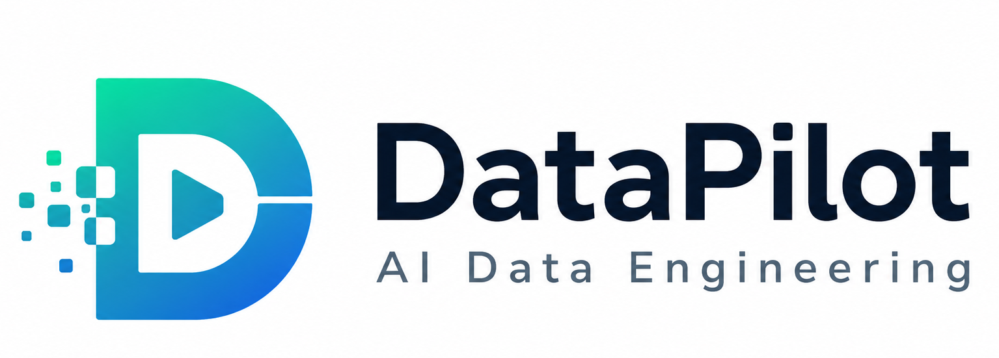

# DataPilot

<p align="center">  </p>

<p align="center"> <strong>AI-Assisted Data Engineering</strong> </p>

<p align="center"> <a href="#documentation">DOCS</a> · <a href="#architecture">ARCHITECTURE</a> · <a href="#quick-start">QUICK START</a> · <a href="#evaluation">EVALUATION</a> </p>

<p align="center">      </p>

Upload dirty CSV / JSON / Excel files. DataPilot profiles them, detects data-quality issues with deterministic rules, uses a small open LLM (OpenRouter) to explain the problems and recommend fixes, and applies only safe, deterministic transformations to produce a clean dataset + quality report.

> **New here?** Read **[GUIDE.md](GUIDE.md)** — start-from-scratch in VS Code, localhost, and deployment.
> For full reference, read **[PROJECT_DOCUMENTATION.md](PROJECT_DOCUMENTATION.md)**.

## Core principle

**LLM ≠ Data Processing Engine.** The model never touches raw rows. Deterministic code (Pandas/rules) does the heavy lifting; the LLM only reasons over schema, statistics, and quality-issue metadata, then returns a structured fix plan that deterministic code executes.

## Status

| Phase | Description                                                           | Status  |
| ----- | --------------------------------------------------------------------- | ------- |
| 1     | Data Engine (ingest / profile / validate / transform / report)        | ✅ done |
| 2     | AI Layer (OpenRouter client, prompts, analyzer)                       | ✅ done |
| 3     | AI Recommendations (Pydantic-validated Fix Plan)                      | ✅ done |
| 4     | Safe Transformation (registered transforms only)                      | ✅ done |
| 5     | Streamlit UI (upload → analyze → explain → review → apply → download) | ✅ done |
| 6     | Evaluation (accuracy/latency/token tracking)                          | ⏳ next |

## Quick start (Windows / VS Code)

```powershell
python -m venv .venv
.\.venv\Scripts\Activate.ps1
pip install -r requirements.txt
copy .env.example .env        # edit: paste OPENROUTER_API_KEY
python -m pytest -q           # 40 tests
streamlit run app/main.py      # http://localhost:8501
```

Headless CLI:

```powershell
python scripts/run_pipeline.py data/sample/sales_dirty.csv --ai
```

## Config

| Env var                | Default                          | Purpose                      |
| ---------------------- | -------------------------------- | ---------------------------- |
| `OPENROUTER_API_KEY`   | —                                | OpenRouter key (AI features) |
| `OPENROUTER_MODEL`     | `google/gemma-4-26b-a4b-it:free` | Model id (swap freely)       |
| `DATAPILOT_AI_ENABLED` | `true`                           | Master AI switch             |

See `.env.example` for the full list.

## Project layout

```
app/
  core/      pipeline, profiler, validator, transformer, reporter
  data/      loader, schema, storage
  ai/        client, prompts, analyzer, parser
  ui/        Streamlit pages
  utils/     config, logger, helpers
scripts/     headless CLI
tests/       pytest suite (40 tests)
data/sample/ sample dirty dataset
docs/        architecture, pipeline, ai-design
GUIDE.md     step-by-step getting-started guide
```

## License

MIT
