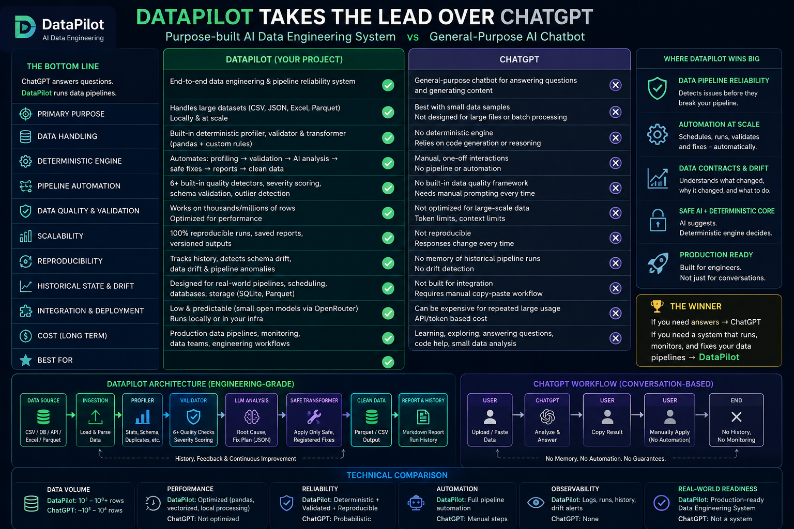

<h1 align="center">🧭 DataPilot</h1>

<p align="center">
  <strong>AI-Assisted Data Engineering</strong><br>
  Upload dirty data. Get a clean dataset, a full quality report, and AI-explained fixes — deterministically.
</p>

<p align="center">
  <a href="#-quick-start"></a>
  <a href="#-tech-stack"></a>
  <a href="#-tech-stack"></a>
  <a href="#-configuration"></a>
  <a href="https://github.com/Sanskar1724/DataPilot/actions"></a>
  <a href="#-license"></a>
</p>

---

## 📖 What is DataPilot?

DataPilot is an end-to-end **data engineering pipeline system**, not a chatbot. Upload a messy file
(CSV / JSON / JSONL / Excel / Parquet) and get:

1. **Deterministic profiling** — rows, columns, duplicates, missing values, per-column stats
2. **Deterministic quality report** — built-in detectors with severity grading
3. **AI explanation** — a small open LLM (via OpenRouter) explains *what's wrong and why*
4. **AI-suggested Fix Plan** — schema-guarded, Pydantic-validated
5. **Clean dataset** — produced by *safe, registered transformations only*
6. **Downloadable output + markdown quality report**

<p align="center">
  
</p>

## ⚡ Core principle

> **LLM ≠ Data Processing Engine.**

The model **never touches raw rows**. Deterministic code (pandas + rules) does the heavy lifting;
the LLM only reasons over *metadata* — schema, statistics, and quality-issue summaries — and returns
a structured fix plan that deterministic code executes.

```
DATA → Deterministic Processing → Metadata → LLM Reasoning
     → Structured Fix Plan → Deterministic Execution → Clean Dataset + Report
```

This keeps the pipeline **cheap, fast, reproducible, and safe** — there is no `eval` or dynamic
code execution anywhere.

## ✨ Features

- **Multi-format ingestion** — CSV, JSON, JSONL, Excel, Parquet (path or raw bytes)
- **Vectorized profiling** — no row iteration; scales to large datasets
- **6+ quality detectors** — missing values, duplicates, inconsistent date formats, negative
  numerics, non-numeric values in numeric columns, mixed types
- **Schema-guarded transforms** — AI plans validated against real columns before execution
- **Safe execution registry** — only whitelisted transformations can run
- **Streamlit UI** — dashboard → upload → quality forensics → AI fix plan → download
- **Headless CLI** — same pipeline, scriptable for automation and scheduling
- **Persistence** — SQLite, Parquet, and local file storage built in
- **Reproducible** — saved reports, run history, and versioned outputs

## 🚀 Quick start

### Windows (PowerShell)

```powershell
git clone https://github.com/Sanskar1724/DataPilot.git
cd DataPilot
python -m venv .venv
.\.venv\Scripts\Activate.ps1
pip install -r requirements.txt
copy .env.example .env        # then paste your OPENROUTER_API_KEY
python -m pytest -q           # verify: 45 passed
streamlit run app/main.py     # open http://localhost:8501
```

### macOS / Linux

```bash
git clone https://github.com/Sanskar1724/DataPilot.git
cd DataPilot
python3 -m venv .venv && source .venv/bin/activate
pip install -r requirements.txt
cp .env.example .env          # then paste your OPENROUTER_API_KEY
python -m pytest -q
streamlit run app/main.py
```

> **No API key?** The deterministic engine works fully offline. Set
> `DATAPILOT_AI_ENABLED=false` (or leave the key empty) to run without AI.

### Headless CLI

```powershell
# Full pipeline with AI analysis
python scripts/run_pipeline.py data/sample/sales_dirty.csv --ai

# Deterministic only, custom output path
python scripts/run_pipeline.py data/sample/sales_dirty.csv --no-ai --clean-csv data/processed/clean.csv
```

## ⚙️ Configuration

Copy `.env.example` → `.env` and configure:

| Variable               | Default                          | Purpose                                       |
| ---------------------- | -------------------------------- | --------------------------------------------- |
| `OPENROUTER_API_KEY`   | —                                | OpenRouter key (**required** for AI features) |
| `OPENROUTER_MODEL`     | `google/gemma-4-26b-a4b-it:free` | Model id — swap freely, no code change        |
| `DATAPILOT_AI_ENABLED` | `true`                           | Master switch for the whole AI layer          |
| `DATAPILOT_LOG_LEVEL`  | `INFO`                           | Logging verbosity                             |
| `OPENROUTER_TIMEOUT`   | `60`                             | LLM call timeout (seconds)                    |

## 🏗️ Project structure

```
DataPilot/
├── app/
│   ├── main.py            # Streamlit entrypoint
│   ├── core/              # pipeline, profiler, validator, transformer, reporter
│   ├── data/              # loader (multi-format), schema inference, storage
│   ├── ai/                # OpenRouter client, prompts, analyzer, Pydantic parser
│   ├── ui/                # Streamlit pages (dashboard, upload, reports)
│   └── utils/             # config, logger, helpers
├── scripts/
│   └── run_pipeline.py    # headless CLI runner
├── tests/                 # pytest suite (45 tests)
├── data/
│   ├── sample/            # real-world messy demo datasets
│   ├── raw/               # your input data (gitignored)
│   └── processed/         # pipeline output (gitignored)
├── reports/               # generated markdown quality reports (gitignored)
└── docs/                  # architecture, pipeline, ai-design, getting started
```

## 📚 Documentation

| Document                                                   | Contents                                      |
| ---------------------------------------------------------- | --------------------------------------------- |
| [Getting started guide](docs/getting-started.md)           | Zero-to-running in VS Code + deployment steps |
| [Project documentation](docs/project-documentation.md)     | Full reference — every module and stage       |
| [Architecture](docs/architecture.md)                       | Module responsibilities & safety invariants   |
| [Pipeline](docs/pipeline.md)                               | Stage-by-stage data flow                      |
| [AI design](docs/ai-design.md)                             | Prompting, validation & fix-plan execution    |

## 🧱 Tech stack

| Component       | Technology                         |
| --------------- | ---------------------------------- |
| Language        | Python 3.11+                       |
| UI              | Streamlit                          |
| Data processing | pandas · DuckDB                    |
| File formats    | Parquet (PyArrow) · SQLite         |
| Validation      | Pydantic + custom vectorized rules |
| LLM access      | OpenRouter via `httpx`             |
| Testing         | pytest                             |
| Configuration   | python-dotenv                      |

## 🗺️ Roadmap

- [x] **Phase 1** — Data engine (ingest / profile / validate / transform / report)
- [x] **Phase 2** — AI layer (OpenRouter client, prompts, analyzer)
- [x] **Phase 3** — AI recommendations (Pydantic-validated Fix Plan)
- [x] **Phase 4** — Safe transformation (registered transforms only)
- [x] **Phase 5** — Streamlit UI (upload → analyze → review → apply → download)
- [ ] **Phase 6** — Evaluation (accuracy / latency / token tracking, drift detection)

## 🤝 Contributing

Contributions are welcome!

1. Fork the repository
2. Create a feature branch (`git checkout -b feat/my-feature`)
3. Run the tests (`python -m pytest -q`) and add tests for new behavior
4. Commit with [conventional commits](https://www.conventionalcommits.org/) (`feat:`, `fix:`, `docs:`)
5. Open a pull request

## 📄 License

Released under the [MIT License](LICENSE).
